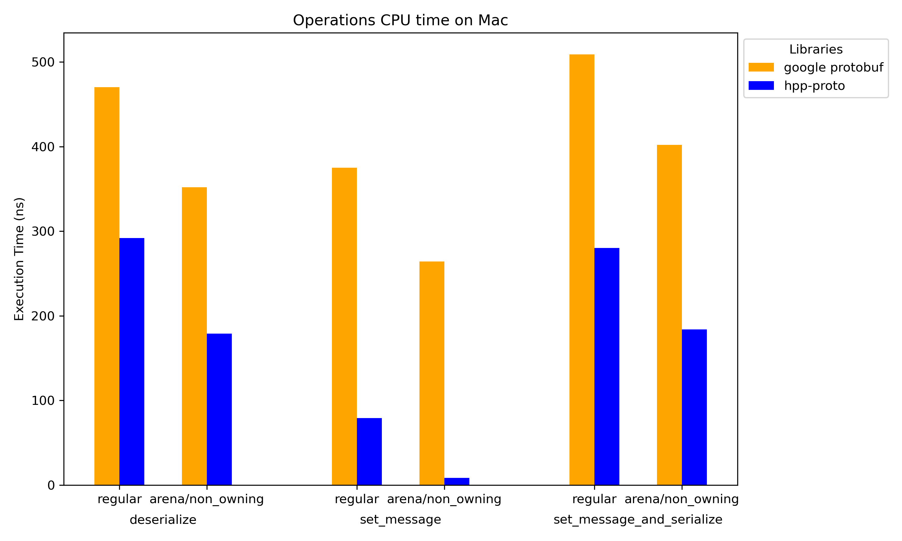

# hpp-proto


[](https://codecov.io/github/huangminghuang/hpp-proto)
[](https://app.codacy.com/gh/huangminghuang/hpp-proto/dashboard?utm_source=gh&utm_medium=referral&utm_content=&utm_campaign=Badge_grade)

Hpp-proto is a modern, high-performance, and header-only C++23 implementation of Google's Protocol Buffers. It is designed from the ground up for extreme performance and minimal code size, making it an ideal choice for resource-constrained environments, real-time systems, and performance-critical applications.

The library leverages modern C++ features and a trait-based design to generate clean, efficient, and highly customizable C++ aggregates from your `.proto` files. It provides first-class support for both binary and JSON serialization, gRPC integration, and dynamic messages.

## Key Features

* **High Performance**: Outperforms the official Google Protobuf library in many common use cases, especially in combined "set and serialize" operations.
* **Modern C++23 Design**: Uses concepts, `consteval`, `std::span`, and other modern features for maximum type safety and performance. The generated code is clean, idiomatic, and easy to work with.
* **Header-Only Core**: The core serialization library is header-only (with one external dependency for UTF-8 validation), simplifying integration into any build system.
* **JSON Support**: First-class serialization and deserialization to and from the canonical ProtoJSON format, powered by the high-performance [glaze](https://github.com/stephenberry/glaze) library.
* **Trait-Based Customization**: A unique trait-based system allows you to customize the generated types without modifying the generated code. Easily swap in custom containers, allocators (like `std::pmr`), or string types to perfectly match your application's memory management strategy.
* **Non-Owning Mode**: Supports a zero-copy mode that utilizes `std::string_view` and `std::span` to avoid unnecessary memory copies.
* **gRPC Integration**: A built-in adapter allows you to use `hpp-proto` generated messages directly in your gRPC client and server applications. ([docs/grpc-adapter.md](docs/grpc-adapter.md)).
* **Dynamic Messages**: A descriptor-driven API allows for runtime processing of messages (including JSON/proto I/O) without needing the compile-time generated types. ([docs/dynamic_message.md](docs/dynamic_message.md)).
* **Minimal Code Size**: Generates significantly smaller binary sizes compared to libprotobuf.
* **Supports Editions, Proto2, and Proto3**: Fully compatible with modern Protobuf features.

## Performance Highlights

Hpp-proto is optimized for scenarios where messages are built or modified and then serialized. While Google's library may be faster in raw serialization of already-constructed objects, hpp-proto shows superior overall performance in combined set-and-serialize benchmarks.

<table>
  <tr>
    <td>
      <a href="benchmarks/Mac_bench.json"></a>
    </td>
    <td>
      <a href="benchmarks/Linux_bench.json"></a>
    </td>
  </tr>
</table>

For more details, see the [benchmarks](benchmarks/ReadMe.md) directory.

## Getting Started

This guide will walk you through creating a simple application using `hpp-proto` with CMake.

### Prerequisites

* A C++23-compatible compiler (e.g., Clang 19+, GCC 13+).
* CMake (version 3.24 or newer).
* The `protoc` compiler. You can download it from the [official Protocol Buffers releases page](https://protobuf.dev/downloads).

### Step 1: Define Your Protocol Format

Create a file named `addressbook.proto`:

```protobuf
// addressbook.proto
syntax = "proto3";

package tutorial;

message Person {
  string name = 1;
  int32 id = 2;
  string email = 3;

  enum PhoneType {
    MOBILE = 0;
    HOME = 1;
    WORK = 2;
  }

  message PhoneNumber {
    string number = 1;
    PhoneType type = 2;
  }

  repeated PhoneNumber phones = 4;
}

message AddressBook {
  repeated Person people = 1;
}
```

### Step 2: Set Up Your CMake Project

Create a `CMakeLists.txt` file. We recommend using `FetchContent` to integrate `hpp-proto` seamlessly.

```cmake
cmake_minimum_required(VERSION 3.25)
project(hpp_proto_tutorial LANGUAGES CXX)

set(CMAKE_CXX_STANDARD 23)
set(CMAKE_CXX_STANDARD_REQUIRED ON)

include(FetchContent)
FetchContent_Declare(
  hpp_proto
  GIT_REPOSITORY https://github.com/huangminghuang/hpp-proto.git
  GIT_TAG main
  GIT_SHALLOW TRUE
)
FetchContent_MakeAvailable(hpp_proto)

# Create a library from our .proto file.
# The generated headers will be available to targets that link against it.
add_library(addressbook_lib INTERFACE addressbook.proto)
target_include_directories(addressbook_lib INTERFACE ${CMAKE_CURRENT_BINARY_DIR})
protobuf_generate_hpp(TARGET addressbook_lib)

# Create our main executable
add_executable(tutorial_proto main.cpp)

# Link the generated code and hpp-proto to our executable
target_link_libraries(tutorial_proto PRIVATE addressbook_lib)
```

### Step 3: Write the C++ Code

Create a `main.cpp` file to define a `Person`, serialize it to binary and JSON, and then deserialize it back.

```cpp
#include "addressbook.pb.hpp"   // For binary serialization
#include "addressbook.glz.hpp"  // For JSON serialization
#include <iostream>
#include <cassert>

// By default, generated messages use std::string, std::vector, etc.
using Person = tutorial::Person<>;

int main() {
    Person p;
    p.id = 1234;
    p.name = "John Doe";
    p.email = "jdoe@example.com";
    p.phones.push_back({.number = "555-4321", .type = Person::PhoneType::HOME});

    // --- Binary Serialization ---
    std::string binary_buffer;
    if (!hpp_proto::write_binpb(p, binary_buffer).ok()) {
        std::cerr << "Binary serialization failed!\n";
        return 1;
    }

    Person p_from_binary;
    if (!hpp_proto::read_binpb(p_from_binary, binary_buffer).ok()) {
        std::cerr << "Binary deserialization failed!\n";
        return 1;
    }
    // read_binpb/read_json do not catch std::bad_alloc. Handle allocation failures explicitly if needed.
    assert(p == p_from_binary);
    std::cout << "Binary round-trip successful!\n";

    // --- JSON Serialization ---
    std::string json_buffer;
    // Use json_opts{.prettify=true} for pretty-printing
    if (!hpp_proto::write_json<hpp_proto::json_opts{.prettify=true}>(p, json_buffer).ok()) {
        std::cerr << "JSON serialization failed!\n";
        return 1;
    }
    std::cout << "\nSerialized JSON:\n" << json_buffer << "\n";

    Person p_from_json;
    if (!hpp_proto::read_json(p_from_json, json_buffer).ok()) {
        std::cerr << "JSON deserialization failed!\n";
        return 1;
    }
    assert(p == p_from_json);
    std::cout << "\nJSON round-trip successful!\n";

    return 0;
}
```

### Step 4: Build and Run

From your project directory:

```bash
cmake -B build
cmake --build build
./build/tutorial_proto
```

You should see output indicating that both binary and JSON round-trips were successful.

## Advanced Usage & Concepts

### Trait-Based Design

One of `hpp-proto`'s most powerful features is its trait-based design, which decouples the generated message layout from specific container types. This lets you tailor the memory-management strategy (value-owning, arena-backed, view-only) for your messages without regenerating code.

* **What Traits Customize**:
  * `string_t`, `bytes_t`: Sequence containers for string/byte fields like `std::string`/`std::vector<std::byte>`.
  * `repeated_t<T>`: Sequence container for repeated fields, like `std::vector`, `small_vector`.
  * `recursive_repeated_t<T>`: Sequence container for recursive repeated fields, i.e., the container can be instantiated with an incomplete T.
  * `map_t<Key, Value>`: Associative container or sequence container of std::pair for map fields (`flat_map`, `btree`, etc.).
  * `optional_indirect_t<T>`: Control lifetimes for recursive messages.
  * `indirect_t<T>`: Control lifetimes for recursive mapped type of map fields.
  * `unknown_fields_range_t`: Define how unknown fields are stored.

* **Supplied Traits**:
  * `hpp_proto::default_traits`: The default. Uses standard STL containers (`std::string`, `std::vector`).
  * `hpp_proto::pmr_traits`: Uses standard STL PMR containers (`std::pmr::string`, `std::pmr::vector`).
  * `hpp_proto::stable_traits`: Uses `flat_map` for map fields regardless of key type.
  * `hpp_proto::pmr_stable_traits`: PMR-backed containers with `flat_map` map fields.
  * `hpp_proto::non_owning_traits`: Zero-copy views using `std::string_view` and `hpp_proto::equality_comparable_span`. Ideal for performance-critical parsing where you can guarantee the backing buffer outlives the message view.
  * `hpp_proto::keep_unknown_fields<Base>`: A mixin to enable unknown-field retention for any base trait.

    `default_traits` uses `flat_map` for integral keys and `std::unordered_map` for string keys. `stable_traits` and `pmr_stable_traits` always use `flat_map` for maps.

* **Example: Customizing Containers**

  You can easily integrate third-party containers by defining a custom traits struct.

  ```cpp
  #include <boost/container/small_vector.hpp>

  struct my_custom_traits : hpp_proto::default_traits {
    // Use small_vector for all repeated fields to reduce heap allocations
    template <typename T>
    using repeated_t = boost::container::small_vector<T, 8>;
    using bytes_t = boost::container::small_vector<std::byte, 32>;

    template <typename Key, typename Mapped>
    using map_t = std::flat_map<typename repeated_t<Key>::value_type, typename repeated_t<Mapped>::value_type,
                                    std::less<Key>, repeated_t<Key>, 
                                    repeated_t<Mapped>>;

  };

  // This message will now use small_vector internally
  using OptimizedMessage = my_package::MyMessage<my_custom_traits>;
  ```

### Optimizing Deserialization with Padded Input

For scenarios requiring maximum deserialization speed, `hpp-proto` supports a `padded_input` mode. By providing a buffer with at least **16 bytes of extra padding** past the end of the valid protobuf data, the parser can skip boundary checks in its inner loops (e.g., when parsing varints or tags).

**Preconditions:**

1. The input range passed to `read_binpb` must represent *only* the valid payload data.
2. The underlying memory block must be accessible for at least 16 bytes beyond the end of that range.
3. The **first byte of the padding must be `0`**. This acts as a sentinel to ensure correct termination of certain parsing loops.

**Zero-Copy with Non-Owning Traits:**
When `padded_input` is used in conjunction with `non_owning_traits`, `string` and `bytes` fields in the deserialized message will point directly to the data in the input buffer rather than allocating new memory. This achieves true zero-copy deserialization but requires the user to ensure the **input buffer remains valid** for the lifetime of the message.

**Example:**

```cpp
// Ensure buffer has extra capacity for padding
std::vector<std::byte> buffer = load_data(); 
auto data_size = buffer.size();
buffer.resize(data_size + 16); 
buffer[data_size] = std::byte{0}; // First padding byte MUST be 0

// Pass the valid data range and the padded_input tag
MyMessage msg;
auto result = hpp_proto::read_binpb(
    msg, 
    std::span{buffer.data(), data_size}, 
    hpp_proto::padded_input
);
```

## Limitations

* **JSON Options**: Lacks support for some of the extended JSON print options found in Google's C++ implementation, like `always_print_fields_with_no_presence` or `preserve_proto_field_names`.

---

For more examples and advanced use cases, please see the [tutorial](tutorial) directory.
