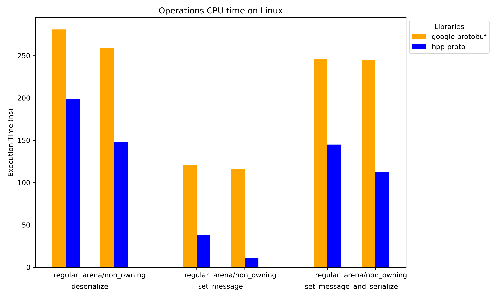

# Comparison with google protobuf C++ implementation
### System Configuration

| Platform |      Mac           |            Linux                |
|----------|--------------------|---------------------------------|
|    OS    |    MacOS 26.2      |         Ubuntu 24.04.2 LTS      |
|   CPU    |   Apple M1 Pro     |  11th Gen Intel(R) Core(TM) i9-11950H @ 2.60GHz |
| Compiler | Apple clang 17.0.0 |           gcc 13.3.0            |

Google protobuf version 33.2

### Runtime Performance

We measured the runtime performance using the dataset and the benchmarks.proto definition from Google Protocol Buffers version 3.6.0. The benchmarks focus on three core operations: deserialization, setting a message (set_message), and setting a message combined with serialization (set_message and serialize). The performance was evaluated on two implementations: Google Protocol Buffers and hpp-proto, with regular and arena/non-owning modes being tested for each operation.

<table>
  <tr>
    <td>
      <a href="Mac_bench.json"></a>
    </td>
    <td>
      <a href="Linux_bench.json"></a>
    </td>
  </tr>
</table>

The performance benchmarks clearly demonstrate the overall efficiency of the hpp-proto library compared to Google’s implementation across deserialization, setting a message, and setting a message with serialization operations. However, for the serialization operation alone, Google’s implementation may be faster than hpp-proto. This comes at the expense of the set_message operation, where hpp_proto significantly outperforms Google’s implementation.

It’s important to note that in real-world applications, setting a message is a prerequisite before serialization can take place. While Google’s implementation may offer faster serialization times, the combined time required for both setting a message and serializing shows that hpp_proto delivers better performance overall.


[Benchmark code is available here](benchmark.cpp)
### Code Size
We compared the code sizes of three equivalent programs: [hpp_proto_decode_encode](hpp_proto_decode_encode.cpp), [google_decode_encode](google_decode_encode.cpp) and [google_decode_encode_lite](google_decode_encode_lite.cpp). These programs are responsible for decoding and encoding messages defined in [benchmarks.proto](https://github.com/protocolbuffers/protobuf/blob/v3.6.0/benchmarks/benchmarks.proto), using the hpp-proto and Google Protocol Buffers implementations. The google_decode_encode program is statically linked with libprotobuf, while google_decode_encode_lite is linked with libprotobuf-lite.

<table>
  <tr>
    <td>
      <a href="Mac_sizes.json"></a>
    </td>
    <td>
      <a href="Linux_sizes.json"></a>
    </td>
  </tr>
</table>

### Running the Benchmarks

To run the benchmarks and update the results on your local machine, configure the project with `HPP_PROTO_BENCHMARKS=ON` and build the `benchmarks` target:

```bash
cmake -B build -DHPP_PROTO_BENCHMARKS=ON
cmake --build build --target benchmarks
```

This will generate and update the `.json` and `.png` files in the `benchmarks` directory.